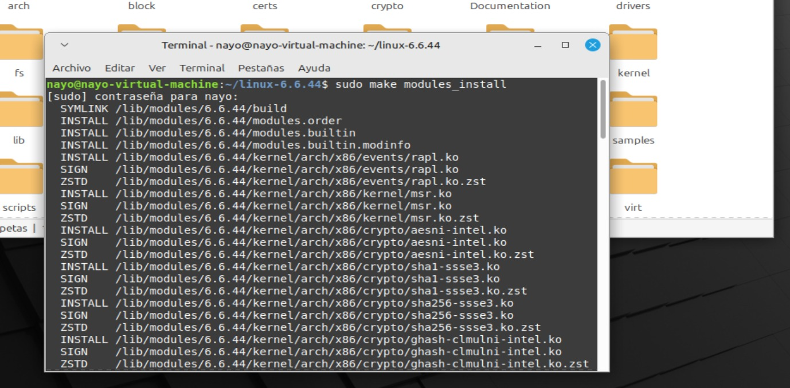

## UNIVERSIDAD SAN CARLOS DE GUATEMALA ##
## FACULTAD DE INGENIERIA ##
## ESCUELA DE CIENCIAS Y SISTEMAS ##
## Sistemas Operativos 2 ##
## SECCIÓN A ##

### PRACTICA 1 ###

### **Nombre:** Genesis Nahomi Aparicio Acan   
### **Carne:** 202113293  

<div id='content'/>

## Contenido

1. [Descargar la imagen ISO](#id1)
2.  [Configurar el entorno](#id2)
    1.  [Actualizar los paquetes](#id21)
    2.  [Instalar dependencias](#id22)
    3.  [Descargar y descomprimir el kernel](#id23)
3.  [Configurar nombre del kernel](#id3)
    1.  [Mensaje personalizado](#id31)
    2.  [Nombre del kernel](#id32)
4.  [Llamadas al sistema](#id4)
    1.  [Hora actual en segundos](#id41)
    2.  [Devuelve el tiempo de actividad del sistema](#id41)
5.  [Compilar el kernel](#id5)
6.  [Instalar el kernel](#id6)
7.  [Verificacion de los cambios del Kernel](#id7)
8.  [Reporte de errores](#id8)
    


 

<div id='id1'/>

### Descargar la imagen ISO 


debes de descargar la imagen ISO desde la pagina oficial de Linux Mint

```bash
 https://www.linuxmint.com/download.php
```

puedes usar cualquiera de las tres versiones de Linux mint , Mate , Xfce o Cinnamon, luego debes de realizar la respectiva instalación  en tu maquina virtual 


<div id='id2'/>

## Configurar el entorno 

<div id='id21'/>

### Actualizar los paquetes

una vez instalado tu sistema operativo debes de actualizar los paquetes para que no ocurran fallos en la marcha

```bash
$  sudo apt update
$  sudo apt upgrade
```


<div id='id22'/>

### Instalar dependencias

Debemos de instalar las dependencias necesarias para el desarrollo y modificación de el kernel 

```bash
$ sudo apt install build-essential libncurses-dev bison flex libssl-dev libelf-dev fakeroot dwarves gcc
```


<div id='id23'/>

### Descargar y descomprimir el kernel

Se debe descargar el código fuente del kernel desde el sitio web oficial [kernel.org](http://kernel.org/).


Usaremos la versión `longterm` del kernel  `6.6.44 ` para mas seguridad utiliza el siguiente comando para descargarlo 

```bash
$ wget https://cdn.kernel.org/pub/linux/kernel/v6.x/linux-6.6.44.tar.xz
```

luego puedes descomprimirlo  como normalmente  o usando el comando 

```bash
$ tar -xf linux-6.6.44.tar.xz
```
<div id='id3'/>

## Configurar nombre del kernel

<div id='id31'/>

### Mensaje personalizado

debemos de realizar las debidas modificaciones a nuestro kernel de Linux por lo que  para mostrar un mensaje personalizado debemos de dirigirnos a la carpeta donde se encuentra nuestro kernel de Linux y luego ingresar a la carpeta init y editar el archivo `main.c`


- desde esta ubicación abrimos el archivo main.c con nuestro editor de texto o bien puedes hacerlo  abriendo una terminal en esta carpeta   y ejecutando el comando nano main.c
- luego de esto nos dirigimos a la función `start_kernel ()`, buscando un lugar adecuado para colocar nuestro mensaje de bienvenida  en este caso lo colocamos luego de  *Linux_banner*

```bash
void start_kernel(void)
{
//codigo
printk(KERN_INFO "Bienvenido - Genesis Nahomi Aparicio Acan - Carnet: 202113293 \\n");
//codigo 
}
```


luego de insertar la linea de código guardamos y cerramos el archivo 

<div id='id32'/>

### Nombre del kernel

- Desde la ubicación donde tenemos el kernel ingresamos a la carpeta include y luego a la carpeta Linux (`include/linux`) , abrimos una consola en la carpeta linux y colocamos el comando nano uts.h
- modificamos el archivo en la lineal `#define UTS_SYSNAME "Linux"` y cambiamos el nombre a `USAC Linux`


<div id='id4'/>

# Llamadas al sistema

<div id='id41'/>

### Hora actual en segundos

colocate en la carpeta donde tienes tu kernel y abre el archivo `arch/x86/entry/syscalls/syscall_64.tbl` y actualiza la entrada con el nuevo número. Coloca la siguiente lineal luego de la ultima  que se mostraba 

``` bash
466 64 get_seconds_time sys_get_seconds_time
```


 

luego debes de editar el archivo `sys.c` en el directorio `kernel` agregando al final de todo el codigo C el siguiente codigo 

```bash
SYSCALL_DEFINE0(get_seconds_time)
{
struct timespec64 ts;
ktime_get_real_ts64(&ts);
return ts.tv_sec;
}
```


<div id='id42'/>

### Devuelve el tiempo de actividad del sistema

colócate en la carpeta donde tienes tu kernel y abre el archivo `arch/x86/entry/syscalls/syscall_64.tbl` y actualiza la entrada con el nuevo número. Coloca la siguiente lineal luego de la ultima  que se mostraba

``` bash 
💡 437 64 uptime sys_uptime
```


luego debes de editar el archivo `sys.c` en el directorio `kernel` agregando al final de todo el codigo C el siguiente codigo 

``` bash
SYSCALL_DEFINE0(uptime)
{
return ktime_get_boottime_seconds();
}
```


### Ultimos 5 logs del sistema

denuevo colocate en la carpeta donde tienes tu kernel y abre el archivo `arch/x86/entry/syscalls/syscall_64.tbl` y actualiza la entrada con el nuevo número. Coloca la siguiente lineal luego de la ultima  que se mostraba 

``` bash 
 468 64 retrieve_last_five_logs sys_retrieve_last_five_logs
```


luego debes de editar el archivo `sys.c` en el directorio `kernel` agregando al final de todo el codigo C el siguiente codigo 

``` bash

#define MAX_LOG_ENTRIES 5
#define KERNEL_LOG_BUFFER_SIZE 1024

SYSCALL_DEFINE2(retrieve_last_five_logs, char __user *, user_log_buffer, size_t, buffer_length) {
    struct kmsg_dump_iter log_iter;
    char *kernel_log_buffer;
    char *output_buffer;
    size_t current_line_length;
    int output_offset = 0;
    int lines_processed = 0;
    int total_log_lines = 0;

    // Check if the provided buffer length is sufficient
    if (buffer_length < KERNEL_LOG_BUFFER_SIZE) {
        return -EINVAL;
    }

    // Allocate memory for the output buffer and kernel log buffer
    output_buffer = kzalloc(buffer_length, GFP_KERNEL);
    if (!output_buffer) {
        return -ENOMEM;
    }

    kernel_log_buffer = kmalloc(KERNEL_LOG_BUFFER_SIZE, GFP_KERNEL);
    if (!kernel_log_buffer) {
        kfree(output_buffer);
        return -ENOMEM;
    }

    // Initialize the kmsg dump iterator and count total log lines
    kmsg_dump_rewind(&log_iter);
    while (kmsg_dump_get_line(&log_iter, true, kernel_log_buffer, KERNEL_LOG_BUFFER_SIZE - 1, &current_line_length)) {
        total_log_lines++;
    }

    // Rewind the iterator and copy the last MAX_LOG_ENTRIES lines to the output buffer
    kmsg_dump_rewind(&log_iter);
    while (kmsg_dump_get_line(&log_iter, true, kernel_log_buffer, KERNEL_LOG_BUFFER_SIZE - 1, &current_line_length)) {
        if (total_log_lines - lines_processed <= MAX_LOG_ENTRIES) {
            if (output_offset + current_line_length >= buffer_length) {
                break;
            }
            memcpy(output_buffer + output_offset, kernel_log_buffer, current_line_length);
            output_offset += current_line_length;
        }
        lines_processed++;
    }

    // Copy the output buffer to the user-provided buffer
    if (copy_to_user(user_log_buffer, output_buffer, output_offset)) {
        kfree(output_buffer);
        kfree(kernel_log_buffer);
        return -EFAULT;
    }

    // Free allocated memory
    kfree(output_buffer);
    kfree(kernel_log_buffer);
    
    // Return the number of bytes copied to the user buffer
    return output_offset;
}


```


<div id='id5'/>

## Compilar el kernel

necesitamos un archivo de configuración ya que no lo tenemos debemos de copiar el archivo que ya tenemos en sistema y copiarlo con el siguiente comando 

``` bash
cp -v /boot/config-"$(uname -r)" .config
```


- con el comando `ls -a`  encontraremos el archivo que copiamos a nuestro kernel
- ya que hay drivers que no necesitamos ya que están compilados en nuestro sistema colocamos el siguiente comando que omitirá todos estos archivos

``` bash
💡 $ make localmodconfig
```


- al ejecutar el comando anterior, se le solicita algún input, simplemente presionar Enter cada vez (sin escribir una respuesta)
- Luego tenemos que modificar el `.config`, ya que al copiar nuestro `.config` se incluyeron nuestras llaves privadas, por lo que tendremos que eliminarlas del `.config`. **Este paso es esencial**

```bash
$ scripts/config --disable SYSTEM_TRUSTED_KEYS
$ scripts/config --disable SYSTEM_REVOCATION_KEYS
$ scripts/config --set-str CONFIG_SYSTEM_TRUSTED_KEYS ""
$ scripts/config --set-str CONFIG_SYSTEM_REVOCATION_KEYS ""
```


Ahora es el momento de compilar el kernel. Para esto simplemente ejecute el comando:

``` bash
💡 fakeroot make -j$(nproc)
```

Para comprobar el estado del proceso al finalizar la compilación, usar el siguiente comando:

```bash
`$ echo $?`
```


si su salida es 0 significa que no hubo ningun error en la compilacion encambio si su salida es algun numero significa que ocurrio algun error y debe volver a compilar el kernel  

<div id='id6'/>

## Instalar el kernel

Primero se instalan los módulos del kernel ejecutando:

```bash
$ sudo make modules_install
```



Luego instalamos el kernel:

```bash
$ sudo make install
```


Después de eso, reiniciamos la computadora para que se complete la instalación.

```bash
$ sudo reboot
```
Con esto ya deberia de tener instalado su sistema al reiniciar pero si esto no funciona dirigete al apartado de errores  [ ***](#id81)


<div id='id7'/>

## Verificacion de los cambios del Kernel

para verificar que hizo corectamente el cambio de kernel ejecute el comando siguiente:

```bash
$ uname -rs
```

para verificar el mensaje de bienvenida ejecute el siguiente comando 
```bash
 $ dmesg | grep "Bienvenido"
 ```

para ver las llamadas al sistema dirijase al directorio donde tiene su  programa en C para validar esas llamadas , en este caso el programa se encientra en la siguiente ruta`/home/nayo/Escritorio/test/` ejecute su archivo y le devolvera las llamadas al sistema

```bash
./test_syscalls
```


Si al hacer alguna llamada al sistema te causó error, olvidaste hacer alguna llamada y compilaste sobre compilado, lo que te hizo tardar más tiempo en compilar, puedes hacer el siguiente paso para evitar problemas de compilación incremental incorrecta: [ ***](#id82)


---

<div id='id8'/>

## Reporte de errores

Durante el desarrollo de la práctica, es frecuente encontrar errores, ya sea por librerías desactualizadas, una configuración incorrecta del entorno de trabajo, o errores de sintaxis. A continuación, se describirán algunos problemas que se encontraron durante su desarrollo y las soluciones que se implementaron.


<div id='id81'/>

### Error al instalar el kernel (el kernel aun es el generico)

Si al instalar el kernel de forma normal y hacer un ` sudo reboot ` tu kernel aun sige siendo el generico te presento una posible solucion a el probleme 

- Debes de abir una terminal y ejecutar el siguiente comando , 

```bash
$ sudo nano /etc/default/grub
```

luego de ejecutar el comando  este nos habrira el archivo de configuracion del GRUB  debe de cambiar la linea  `GRUB_DEFAULT =0` por :

```bash
GRUB_DEFAULT="Advanced options for Linux Mint 22 Xfce>Linux Mint 22 Xfce, with Linux 6.6.44”
```


para cambiar el kernel generico a el kernel que deseamos "Recuerda que esto `Linux Mint 22 Xfce` debes de cambiarlo segun la version de linux que hayas instalado ya sea mint, cinammon o Xfce"

Actualiza la configuración de GRUB ejecutando:
```bash
$ sudo update-grub
```
Reinicia tu computadora para que los cambios surtan efecto:

```bash
$ sudo reboot
```

---

<div id='id82'/>

### Compilación incremental incorrecta


Para eliminar los archivos generados durante la compilacion y que no nos causen errorres utilizaremos el siguiente comando 


```bash
$ make clean
```


Esto ayuda a asegurar que la próxima vez que se compile el proyecto, no haya conflictos con archivos generados anteriormente.

luego realizaremos una limpieza mas profunda y eliminaremos los archivos generados durante la compilacion , de esta forma eliminaremos configuraciones y otros archivos 

```bash
$ make mrproper
```


con esto realizado ya podemos volver a compilar nuestro kernel desde este paso   [Compilar el kernel](#id5)


<div id='id83'/>

---
### Recurso utilizado 

Antes de asignar un nuevo número de llamada al sistema, se debe revisar el archivo `arch/x86/entry/syscalls/syscall_64.tbl` para asegurarse de que el número que se planea utilizar no esté ya en uso. En un caso anterior, no se detectó que el número ya estaba en uso, lo que provocó un error durante la compilación. En consecuencia, el número tuvo que cambiarse a `469 para sys_retrieve  retrieve_last_five_logs `.


 

