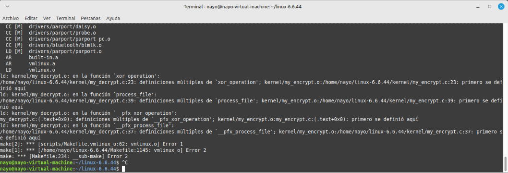
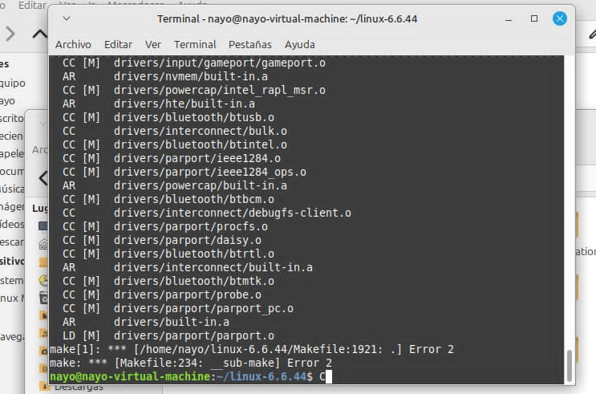

## UNIVERSIDAD SAN CARLOS DE GUATEMALA 
## FACULTAD DE INGENIERIA 
## ESCUELA DE CIENCIAS Y SISTEMAS 
## Sistemas Operativos 2 
## SECCIÓN A 

### PRACTICA 2 

### **Nombre:** Genesis Nahomi Aparicio Acan   
### **Carne:** 202113293  


### Indice
- [Desarrollo de llamadas al sistema](#pruebas)
- [Crear el Archivo de Encabezado ](#Encabezado)
- [Actualizar syscall_64.tbl ](#Actualizar)
- [Actualizar Makefile](#Makefile)
- [Actualizar syscall.h ](#syscall)
- [Instalar el kernel](#Instalar)
- [Errores](#Errores)

---


## Desarrollo de llamadas al sistema  <div id="Desarrollo"></div>

Primero debes de dirigirte a la siguiente carpeta `linux-6.6.44/kernel`

### Llamada my_encrypt.c

En la carpeta anterior crearas un archivo llamado `my_encrypt.c`, este archivo se desglosa de la siguiente manera 


1.  Inclusión de Cabeceras

Estas cabeceras incluyen las definiciones necesarias para trabajar con llamadas al sistema (syscalls), acceso a sistemas de archivos (fs), transferencia de datos entre el espacio de usuario y el kernel (uaccess), manejo dinámico de memoria (slab), manejo de hilos (kthread) y funciones de retraso (delay).

```bash
#include <linux/syscalls.h>
#include <linux/fs.h>
#include <linux/uaccess.h>
#include <linux/slab.h>
#include <linux/kthread.h>
#include <linux/delay.h>

```
2.  Estructura Fragment

Esta estructura define un fragmento de datos a procesar por cada hilo, que incluye los datos mismos, el tamaño de los datos, la clave para realizar la operación XOR, el tamaño de la clave, y los índices que determinan el rango específico del fragmento a procesar.

```bash
typedef struct {
    unsigned char *buffer;
    size_t data_size;
    unsigned char *encryption_key;
    size_t key_length;
    size_t start_idx;
    size_t end_idx;
} DataFragment;
```

3.  Estructura para Pasar Argumentos a los Hilos

Esta estructura encapsula el fragmento de datos que cada hilo debe procesar y una variable done para señalar la finalización del hilo.

```bash
struct task_params {
    DataFragment data_fragment;
    struct completion completed_event;
};
```

4.  Función xor_operation: Operación XOR en Hilos

La función realiza una operación XOR entre los datos y la clave de cifrado, tomando como argumento un puntero a una estructura task_args. Itera sobre el fragmento de datos asignado, aplicando XOR byte a byte con la clave, repitiéndola mediante el operador módulo (%). Finalmente, utiliza complete(&targs->done) para señalar que el hilo ha completado su tarea

```bash
int perform_xor_operation(void *arg) {
    struct task_params *params = (struct task_params *)arg;
    DataFragment *fragment = &params->data_fragment;
    size_t i;

    printk(KERN_INFO "Thread iniciado: start_idx=%zu, end_idx=%zu\n", fragment->start_idx, fragment->end_idx);

    for (i = fragment->start_idx; i < fragment->end_idx; i++) {
        fragment->buffer[i] ^= fragment->encryption_key[i % fragment->key_length];
    }

    printk(KERN_INFO "Thread finalizado: start_idx=%zu, end_idx=%zu\n", fragment->start_idx, fragment->end_idx);
    complete(&params->completed_event);
    return 0;
}
```

5. Función process_file

La función realiza una operación XOR entre los datos y la clave de cifrado, tomando como argumento un puntero a una estructura task_args. Itera sobre el fragmento de datos asignado, aplicando XOR byte a byte con la clave, repitiéndola mediante el operador módulo (%). Finalmente, utiliza complete(&targs->done) para señalar que el hilo ha completado su tarea

```bash
int handle_file_encryption(const char *input_filepath, const char *output_filepath, const char *key_filepath, int thread_count) 
```

Esta es la función principal que gestiona la encriptación del archivo. Se divide en varias secciones clave


a. Abrir los archivos

Se abren los archivos de entrada, salida y la clave con las funciones del sistema de archivos del kernel. Si algún archivo falla al abrirse, se retorna un código de error.

 ```bash
input_file = filp_open(input_filepath, O_RDONLY, 0);
output_file = filp_open(output_filepath, O_WRONLY | O_CREAT | O_TRUNC, 0644);
key_file = filp_open(key_filepath, O_RDONLY, 0);

 ```
b. Leer la clave

Se obtiene el tamaño del archivo de la clave y luego se reserva memoria en el kernel para almacenarla.kernel_read lee la clave desde el archivo y la almacena en memoria.

```bash    
key_length = i_size_read(file_inode(key_file));
encryption_key = kmalloc(key_length, GFP_KERNEL);
ret_val = kernel_read(key_file, encryption_key, key_length, &key_offset);
 ```

c. Leer el archivo de entrada

Similar al proceso de lectura de la clave, el tamaño del archivo de entrada se obtiene y se lee todo el contenido en memoria.

```bash
file_size = i_size_read(file_inode(input_file));
file_buffer = kmalloc(file_size, GFP_KERNEL);
ret_val = kernel_read(input_file, file_buffer, file_size, &in_offset);
```

d. Asignar memoria y dividir el trabajo entre hilos

Se reservan arrays para almacenar las estructuras de tareas (tasks), los hilos (threads) y los fragmentos de datos (fragments).El archivo se divide en fragmentos de tamaño similar y se asignan a cada hilo. El último fragmento puede ser más grande si hay un resto (remainder).

```bash
thread_list = kmalloc(sizeof(struct task_struct *) * thread_count, GFP_KERNEL);
task_list = kmalloc(sizeof(struct task_params) * thread_count, GFP_KERNEL);
fragment_list = kmalloc(sizeof(DataFragment) * thread_count, GFP_KERNEL);
```

e. Crear y ejecutar hilos

Se crean múltiples hilos (kthread_run) para procesar cada fragmento de datos en paralelo utilizando la función xor_operation.

```bash
for (i = 0; i < thread_count; i++) {
    task_list[i].data_fragment = fragment_list[i];
    ...
}
```

f. Esperar a que todos los hilos terminen
La función wait_for_completion se usa para esperar a que todos los hilos completen su tarea antes de continuar.

```bash
for (i = 0; i < thread_count; i++) {
        printk(KERN_INFO "Esperando a que el thread %d termine\n", i);
        wait_for_completion(&task_list[i].completed_event);
    }
```


g. Escribir los datos encriptados en el archivo de salida

Una vez que todos los hilos han terminado, el archivo encriptado se escribe en el archivo de salida usando kernel_write.

```bash
ret_val = kernel_write(output_file, file_buffer, file_size, &out_offset);
```

h. Liberar memoria y cerrar archivos

Se libera toda la memoria que se asignó dinámicamente y se cierran los archivos.

```bash
kfree(thread_list);
kfree(task_list);
kfree(fragment_list);
kfree(file_buffer);
kfree(encryption_key);
filp_close(key_file, NULL);
filp_close(output_file, NULL);
filp_close(input_file, NULL);
return ret_val;
```    

6. Syscall my_encrypt

La syscall my_encrypt permite al usuario invocar el cifrado desde el espacio de usuario, copiando las rutas de los archivos al espacio del kernel con strndup_user, llama a process_file para ejecutar el cifrado, y luego libera la memoria y retorna el resultado de la operación.

``` bash
SYSCALL_DEFINE4(my_encrypt, const char __user *, input_filepath, const char __user *, output_filepath, const char __user *, key_filepath, int, thread_count) 
```

a. Copiar rutas desde el espacio de usuario al espacio del kernel

Utiliza strndup_user para copiar las rutas de archivos desde el espacio de usuario al espacio del kernel. PATH_MAX define el tamaño máximo permitido para las rutas.

``` bash
k_input_filepath = strndup_user(input_filepath, PATH_MAX);
k_output_filepath = strndup_user(output_filepath, PATH_MAX);
k_key_filepath = strndup_user(key_filepath, PATH_MAX);
```

b.Llamada a la función de procesamiento de archivos

Llama a la función process_file para realizar el cifrado, pasando las rutas de los archivos y el número de hilos.

``` bash
ret_val = handle_file_encryption(k_input_filepath, k_output_filepath, k_key_filepath, thread_count);
```

c. Liberación de memoria y retorno del resultado

En el bloque out_free, libera la memoria asignada para las rutas de los archivos y retorna el resultado de la operación (ret), que puede ser el valor de retorno de process_file o un código de error.

``` bash
free_memory:
kfree(k_input_filepath);
kfree(k_output_filepath);
kfree(k_key_filepath);
return ret_val;
```
### Llamada my_dencrypt.c

Crearas un archivo llamado `my_dencrypt.c` trabaja exactamente de la misma manera, debido a que XOR es simétrico se utiliza el mismo código para trabajar los datos.

## Crear el Archivo de Encabezado <div id="Encabezado"></div>

dirigete al archivo  `linux-6.6.44/include/linux` y crea el archivo `syscalls_usac.h` el cual tendra el siguiente codigo

``` bash
// include/linux/syscalls_usac.h

#ifndef _SYSCALLS_USAC_H
#define _SYSCALLS_USAC_H

#include <linux/types.h>

asmlinkage long sys_my_encrypt(const char __user *input_path, const char __user *output_path, const char __user *key_path, int num_threads);

asmlinkage long sys_my_dencrypt(const char __user *input_path, const char __user *output_path, const char __user *key_path, int num_threads);


#endif // _SYSCALLS_USAC_H
```


## Actualizar syscall_64.tbl <div id="Actualizar"></div>

dirigete al archivo  `arch/x86/entry/syscalls/syscall_64.tbl` y agrega al  archivo  lo siguiente

``` bash
551   common  my_encrypt    sys_my_encrypt
552   common  my_encrypt    sys_my_dencrypt

```

## Actualizar Makefile <div id="Makefile"></div>

dirigete al archivo  `kernel/Makefile` y agrega al archivo lo siguiente para que funcionen tus dos llamadas al sistema 

``` bash
obj-y += my_encrypt.o
obj-y += my_dencrypt.o
```

## Actualizar syscall.h <div id="syscall"></div>

dirigete al archivo  `include/linux/syscall.h` y agrega al archivo lo siguiente para que funcionen tus dos llamadas al sistema 

``` bash
asmlinkage long sys_my_encrypt(const char __user *input_path, const char __user *output_path, const char __user *key_path, int num_threads);
asmlinkage long sys_my_dencrypt(const char __user *input_path, const char __user *output_path, const char __user *key_path, int num_threads);
```

## Compilar el kernel <div id="Compilar"></div>

necesitamos un archivo de configuración ya que no lo tenemos debemos de copiar el archivo que ya tenemos en sistema y copiarlo con el siguiente comando  

``` bash
cp -v /boot/config-"$(uname -r)" .config
```

ya que hay drivers que no necesitamos ya que están compilados en nuestro sistema colocamos el siguiente comando que omitirá todos estos archivos

``` bash
$ make localmodconfig
```

- al ejecutar el comando anterior, se le solicita algún input, simplemente presionar Enter cada vez (sin escribir una respuesta)
- Luego tenemos que modificar el `.config`, ya que al copiar nuestro `.config` se incluyeron nuestras llaves privadas, por lo que tendremos que eliminarlas del `.config`. **Este paso es esencial**

```bash
$ scripts/config --disable SYSTEM_TRUSTED_KEYS
$ scripts/config --disable SYSTEM_REVOCATION_KEYS
$ scripts/config --set-str CONFIG_SYSTEM_TRUSTED_KEYS ""
$ scripts/config --set-str CONFIG_SYSTEM_REVOCATION_KEYS ""
```


Ahora es el momento de compilar el kernel. Para esto simplemente ejecute el comando:

``` bash
fakeroot make -j$(nproc)
```

Para comprobar el estado del proceso al finalizar la compilación, usar el siguiente comando:

```bash
$ echo $?
```

si su salida es 0 significa que no hubo ningun error en la compilacion encambio si su salida es algun numero significa que ocurrio algun error y debe volver a compilar el kernel  


## Instalar el kernel <div id="Instalar"></div>

Primero se instalan los módulos del kernel ejecutando:

```bash
$ sudo make modules_install
```


Luego instalamos el kernel:

```bash
$ sudo make install
```

Después de eso, reiniciamos la computadora para que se complete la instalación.

```bash
$ sudo reboot
```


## Errores en la practica  <div id="errores"></div>

### Error 1: Definiciones múltiples

al crear los archivos de las llamadas al ser casi el mismo codigo para encriptar y desencriptar se opto por dejar que el nombre de las funciones fueran las mismas en cada archivo pero esto al ser llamadas al sistema trajo un error.  el error mostraba que las funciones xor_operation, process_file y pfx_xor_operation estában definidas varias veces en el  archivo my_encrypt.c el compilador encontraba conflictos .


##### Solucion

Esto se soluciono cambiando el nombre de las funciones de my_dencrypt.c. Se hizo un make clean para limpiar la compilacion y se volvio a hacer una compilacion limpia 




### Error 2: Error del Makefile

se creo otro make file para hacer la compilacion de los archivos nuevos de syscalls pero al hacer esto hubo un error de conflictos , asi que en el mismo makefile de la carpeta kernel se agrego las definiciones para las llamada 



##### Solucion
se habian agregado las llamadas de esta forma pero se agregaron de esta forma  `obj-m += my_encrypt.o` , `obj-m += my_dencrypt.o` pero al no ser un modulo externo causo error la solucion fue cambiarlo a  `obj-y += my_encrypt.o`  y `obj-y += my_dencrypt.o`

### Error 2: Error de librerias 

se intentaron usar en las nuevas lamadas al sistema esta librerias `mm_segment_t`, `get_fs()`, `y set_fs()` pero estas ya no funcionan para verciones recientes del kernel de linux   

##### Solucion 
para esto se cambiaron las anteriores librerias por `kernel_read()` y `kernel_write()` las cuales se usan para leer y escribir datos desde y hacia archivos en el kernel. 


